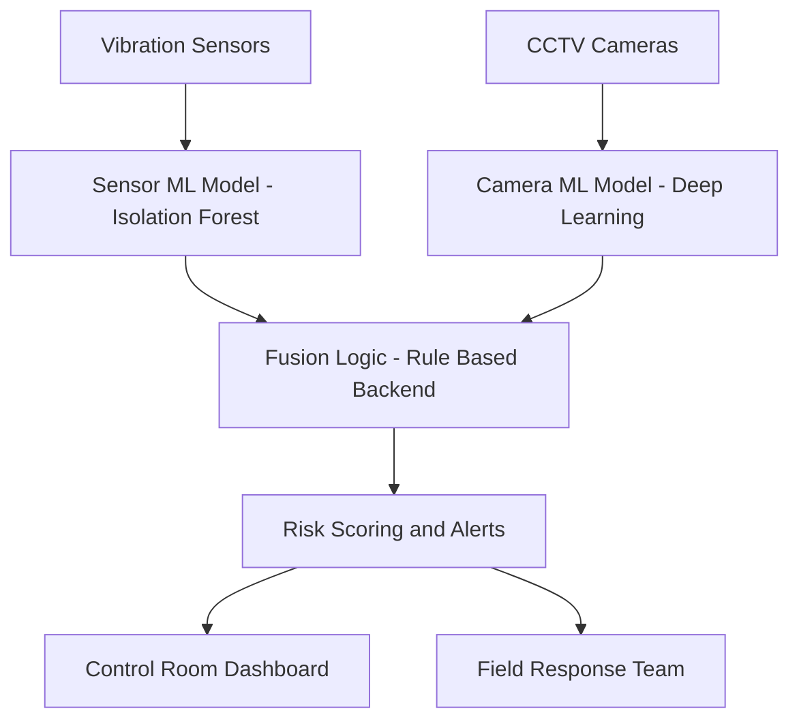

# Hack4Delhi – Railway Track Tampering Detection System
# RTAM — Railway Track Anomaly Monitor

RTAM is a multi-modal AI-based monitoring system designed to detect **intentional railway track tampering** using sensor intelligence, camera intelligence, and backend fusion logic.

---

## 1. Problem Statement

Intentional railway track tampering—such as rail cutting, bolt loosening, or mechanical interference—poses a severe risk to public safety and railway infrastructure.

Existing monitoring approaches rely on:
- Manual inspection
- Single-modality sensing
- Post-incident detection

These methods are insufficient for **early detection**, especially during night-time, adverse weather, or low-visibility conditions.

---

## 2. Chosen Domain

**Artificial Intelligence (Cross-Sector)**  
Hack4Delhi Problem Statement:  
**AI system to detect intentional Railway Track Tampering**

---

## 3. Proposed Solution

RTAM proposes a **multi-modal AI system** that integrates:

- Vibration sensors for continuous mechanical monitoring
- CCTV cameras for visual inspection of track conditions
- Machine learning models for automated analysis
- Backend fusion logic for reliable risk assessment

By combining multiple intelligence sources, RTAM reduces false positives and improves detection reliability.

---

## 4. System Architecture

---

## 5. Machine Learning Layer (Overview)

RTAM employs two complementary machine learning components:

- **Sensor-based ML** to detect abnormal vibration patterns indicating mechanical interference
- **Camera-based ML** to visually identify defects or suspicious activities on railway tracks

These models operate independently and provide inputs to the backend fusion layer.

Detailed ML design and implementation are documented in the repository README.

---

## 6. Fusion Logic

RTAM uses a **rule-based fusion layer** implemented in the backend to combine outputs from sensor-based and camera-based ML models.

The fusion layer:
- Correlates physical anomalies with visual evidence
- Reduces false alarms
- Produces a final risk classification (Low / Medium / High)

This approach ensures explainable and auditable decision-making suitable for safety-critical systems.

---

## 7. Backend System

The backend system is responsible for:
- Receiving ML outputs
- Executing fusion logic
- Managing alerts and event logs
- Serving processed data to the frontend dashboard

The backend is designed as modular, scalable services using REST APIs.

---

## 8. Frontend Dashboard

The frontend provides a control-room interface that displays:
- Real-time alerts
- Risk levels
- Sensor anomaly trends
- Visual evidence from camera feeds

This enables authorities to make quick, informed decisions.

---

## 9. End-to-End Workflow

1. Sensors and cameras monitor railway tracks continuously
2. Sensor ML analyzes vibration data
3. Camera ML analyzes track images
4. Backend fusion logic combines ML outputs
5. Risk-based alerts are generated
6. Control room reviews alerts and evidence
7. Field teams are dispatched if required

---

## 10. Technology Stack (High-Level)

- **Machine Learning:** Python, Scikit-learn, PyTorch
- **Backend:** Python, REST APIs
- **Frontend:** Web-based dashboard
- **Deployment:** Modular and scalable architecture

---

## 11. Conclusion

RTAM demonstrates how **multi-modal AI systems** can significantly enhance railway safety by enabling early detection, visual confirmation, and explainable decision-making.

The system is designed for real-world deployment and integration with existing railway infrastructure.
